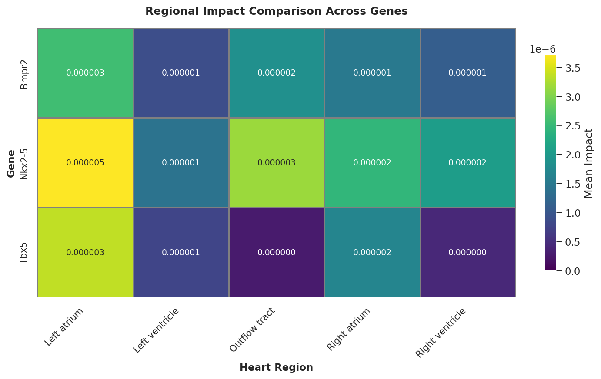

## 1. Data Processing & Model Architecture

### 🧬 Rapid Prototyping Strategy
To get a quick baseline given the short timeline, I used **Geneformer** [[Theodoris et al., Nature 2023](https://doi.org/10.1038/s41586-023-06139-9)]. It is pretrained on human data, allowing me to start immediately without spending weeks training a foundation model from scratch.

!!! note "Current Limitations"
    This is a preliminary demo, so there are a few technical trade-offs:
    
    * **Cross-Species Mapping**: I mapped Mouse genes to Human IDs via homology. This introduces some noise since regulatory elements aren't always conserved.
    * **Tokenization Bias**: The model uses **rank-value encoding**. As shown in the embedding analysis, this strategy creates a **"Length Bias"** (dependency on `n_counts`) when used in zero-shot tasks.
    * **Future Optimization**: Moving to model architectures that treat expression profiles as structured/tabular inputs might help mitigate these depth-related artifacts.

### 🐁 The Dataset: 3D Mouse Heart (MOSTA)
The study utilizes the **MOSTA** (Mouse Organogenesis Spatiotemporal Transcriptomic Atlas) dataset [[Chen et al., Cell 2022](https://doi.org/10.1016/j.cell.2022.04.003)]. The analysis focuses on two critical developmental stages:

* **E9.5**: Characterized by heart looping and Outflow Tract (OFT) formation.
* **E11.5**: Characterized by ventricular septation and chamber maturation.

### Interactive 3D Visualization
Below are the reconstructed 3D spatial maps of the heart samples processed in this workflow.

=== "🖱️ Mouse E9.5 Heart"
    <iframe src="assets/plots/3d_heart_E9.5.html" width="100%" height="600px" frameborder="0"></iframe>

=== "🖱️ Mouse E11.5 Heart"
    <iframe src="assets/plots/3d_heart_E11.5.html" width="100%" height="600px" frameborder="0"></iframe>

---

## 2. Embedding Space Analysis

### 🔍 Analysis of Embedding Bias
Without fine-tuning, the raw embeddings show a strong correlation with sequencing depth (`n_counts`). This is caused by the **rank-value encoding strategy**, where the sequence length relates directly to the total number of detected genes.

* **Observation**: In the raw UMAP, we see some initial geometric structures. However, the cell types are intermixed, and the main topology follows the gradient of total read counts (`n_counts`).
* **Correction Method**: I attempted to mitigate this by using a linear regression model to remove the variance explained by `log1p(n_counts)`. This reduced the depth effect to some extent.
* **Result & Interpretation**: Post-correction, the embedding space revealed more complex manifolds. While `n_counts` bias persists, the remaining structures likely encode orthogonal biological signals such as **cell cycle phases** or **metabolic states**. In rapidly proliferating embryonic tissues, these states are often biologically coupled with total RNA content, creating a complex signal that simple regression cannot fully disentangle without explicit biological supervision.

!!! tip "Embedding Visualization"
    Select a developmental stage to compare the embedding landscape before and after regression.

    === "📅 Stage: E9.5"
        
        === "Original UMAP (Bias)"
            The distribution is dominated by the `n_counts` gradient.
            { width="600" }

        === "Regressed UMAP (Improved)"
            Emergence of complex manifolds, though lineage separation requires further fine-tuning.
            { width="600" }

    === "📅 Stage: E11.5"
        
        === "Original UMAP (Bias)"
            { width="600" }

        === "Regressed UMAP (Improved)"
            { width="600" }

---

## 3. Spatiotemporal In Silico Perturbation

I performed *in silico* deletion of key transcription factors to predict their functional impact on cardiac morphogenesis.

### 🎯 Gene Selection Rationale
* **Nkx2-5 (The Validator)**: Essential for myocardial differentiation. Loss leads to Outflow Tract (OFT) defects (e.g., Tetralogy of Fallot). **Selected to validate model sensitivity against known biology.**
* **Bmpr2 (The Disease Model)**: Critical for vascular endothelium. Mutations are linked to PAH. **Selected to demonstrate relevance to vascular pathology.**
* **Tbx5 (The Spatial Control)**: Expressed specifically in the left ventricle and atria. **Selected to test the spatial specificity of the predictions.**

### 📊 Impact Score Definition
The **"Impact Score"** quantifies the phenotype shift caused by the perturbation. It is calculated as the cosine distance between the embedding vectors of the original cell (E_orig) and the perturbed cell (E_perturb):

A higher score indicates a significant loss or shift of cellular identity.

### 🔮 Interactive 3D Impact Map

!!! tip "Interactive Discovery: Isolate the OFT"
    For **E9.5 Nkx2-5**:
    The impact is highly localized. To visualize this clearly: **Double-click on the 'Outflow Tract' label** in the figure legend. This will isolate the OFT structure, revealing an intense concentration of high impact scores (red hotspot) that aligns with the etiology of Tetralogy of Fallot.

=== "📅 Stage: E9.5 (Early)"
    
    === "🧬 Nkx2-5"
        **Prediction**: Strong impact localized to the **Outflow Tract (OFT)**.
        <iframe src="assets/plots/E9p5_Nkx2-5_comparison_3d.html" width="100%" height="500px" frameborder="0"></iframe>
    
    === "🧬 Bmpr2"
        **Prediction**: Localized impact on endothelial/endocardial populations.
        <iframe src="assets/plots/E9p5_Bmpr2_comparison_3d.html" width="100%" height="500px" frameborder="0"></iframe>

    === "🧬 Tbx5"
        **Prediction**: Impact concentrated in the primitive Atrium and Left Ventricle.
        <iframe src="assets/plots/E9p5_Tbx5_comparison_3d.html" width="100%" height="500px" frameborder="0"></iframe>

=== "📅 Stage: E11.5 (Mid)"
    
    === "🧬 Nkx2-5"
        **Prediction**: Impact shifts towards the Ventricular Septum and chamber walls.
        <iframe src="assets/plots/E11p5_Nkx2-5_comparison_3d.html" width="100%" height="500px" frameborder="0"></iframe>
    
    === "🧬 Bmpr2"
        <iframe src="assets/plots/E11p5_Bmpr2_comparison_3d.html" width="100%" height="500px" frameborder="0"></iframe>

    === "🧬 Tbx5"
        <iframe src="assets/plots/E11p5_Tbx5_comparison_3d.html" width="100%" height="500px" frameborder="0"></iframe>

---

### 📈 Quantitative Analysis: Cell Type Vulnerability
To quantify the "Functional Shift" over developmental time, I aggregated the impact scores by annotated cell types.

!!! abstract "Biological Interpretation: The Critical Window"
    The aggregated impact scores reveal a striking spatiotemporal dynamic for **Nkx2-5**:

    At **E9.5**, the *Nkx2-5* deletion yields the highest impact score (**1.7e-5**) specifically in the **Outflow Tract (OFT)**, which is nearly **8x higher** than in the Right Ventricle. This computationally recapitulates the "Critical Window" for OFT formation, identifying it as the most vulnerable structure to *Nkx2-5* loss at this specific stage. 
    
    By **E11.5**, this focused impact dissipates (decreasing to 0.3e-5), mirroring the anatomical timeline where OFT morphogenesis concludes and septation begins.

=== "Heatmap: E9.5"
    

=== "Heatmap: E11.5"
    